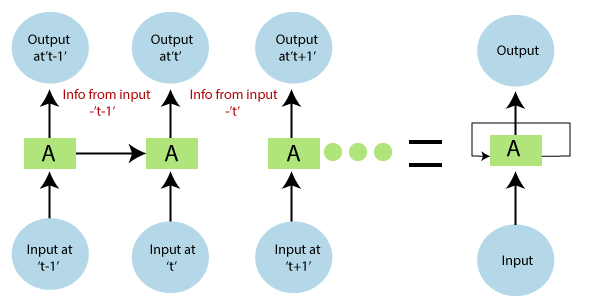

# Human-Activity-recognition

Taken the data from UCI repository then predicted using LSTM-RNN

<h2>Introduction:</h2>

Human Activity Recognition is a time-series classification problem.The data has been generated by using the Accelerometer and the Gyroscope along with the smartphones.

These sensors record the data from the following activities.

<ol>
  <li>Walking</li>
  <li>Upstairs</li>
  <li>Downstairs</li>
  <li>Sitting</li>
  <li>Standing</li>
  <li>Laying</li>
</ol>
  

In this project I have predicted the human activity by using a deep_learning model RNN_LSTM

The Human Ativity Recognition is applied in the field of the  Serveillance System,Healthcare,Human Computer Intraction etc.

<h2> Dataset Info:</h2>

The DataSet Has been taken from the UCI repository which you can get <a href="https://archive.ics.uci.edu/ml/datasets/human+activity+recognition+using+smartphones">here </a>

The experiments have been carried out with a group of 30 volunteers within an age bracket of 19-48 years. Each person performed six activities (WALKING, WALKING_UPSTAIRS, WALKING_DOWNSTAIRS, SITTING, STANDING, LAYING) wearing a smartphone (Samsung Galaxy S II) on the waist. Using its embedded accelerometer and gyroscope, we captured 3-axial linear acceleration and 3-axial angular velocity at a constant rate of 50Hz. The experiments have been video-recorded to label the data manually. The obtained dataset has been randomly partitioned into two sets, where 70% of the volunteers was selected for generating the training data and 30% the test data.

The sensor signals (accelerometer and gyroscope) were pre-processed by applying noise filters and then sampled in fixed-width sliding windows of 2.56 sec and 50% overlap (128 readings/window). The sensor acceleration signal, which has gravitational and body motion components, was separated using a Butterworth low-pass filter into body acceleration and gravity. The gravitational force is assumed to have only low frequency components, therefore a filter with 0.3 Hz cutoff frequency was used. From each window, a vector of features was obtained by calculating variables from the time and frequency domain.

<h2>Model Info:</h2>
<h3>Recurrence Neural Network</h3>

Recurrence Neural Network (RNN) are a type of Neural Network in which the output from the previous steps are fed as input to the current step.The most important feature of the RNN is  <strong>Hidden Layer</strong> which remembers information about a sequence.RNN have a memory which remembers all information about what has been calculated.

  
<h3>LSTM</h3>

With the recent breakthroughs that have been happening in data science, it is found that for almost all of these sequence prediction problems, Long short Term Memory networks, a.k.a LSTMs have been observed as the most effective solution.

LSTMs have an edge over conventional feed-forward neural networks and RNN in many ways. This is because of their property of selectively remembering patterns for long durations of time. It impoves the RNN model by removing the plroblem caused by vanishing gradient.

 

<h2>Result:</h2>
Testing Accuracy: 86.63046956062317%

Precision: 86.98466418351313%
Recall: 86.63047166610112%
f1_score: 86.50732876802357%

Confusion Matrix:
[[489   3   4   0   0   0]
 [ 87 358  26   0   0   0]
 [ 34  60 326   0   0   0]
 [  0   3   0 389  94   5]
 [  0   2   0  68 462   0]
 [  0   2   0   0   6 529]]
  
 
 
